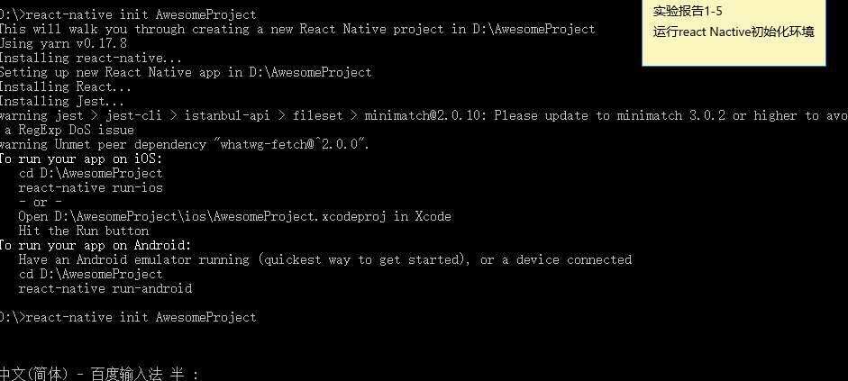

#react-native学习中的问题
***********************
##环境配置
 一开始将文件放在System32中出现问题，将项目建在D中，应该是System32文件的文件权限的问题
成功之后的结果为

**********************************

##Invariant Violation:Applicaction 项目名 has not been registered

nvariant Violation:Applicaction 项目名 has not been registered.This is either due to a require() error during initialization or failure to call AppRegistry.registerCommponent.
这个错误的根本原因是根目录./index.android.js中
<pre>
	<code>AppRegistry.registerComponent('项目名',() => ...);
	</code>
</pre>
项目名不一致，中间手残的改了
与./andorid/项目名/appDelegate.m中的

##但是，还有一种情况！
即便你确保一致了但还是出现相同的错误提示，这又是怎么搞得呢？这个时候你可以检查一下你的命令行。有可能你同时在运行一个以上的程序，像我。如果你的react-native在运行程序A而你打开了程序B，也会出现相同的问题。解决方法很简单，关掉命令行运行程序。ctrl+c,运行你想运行的程序。

